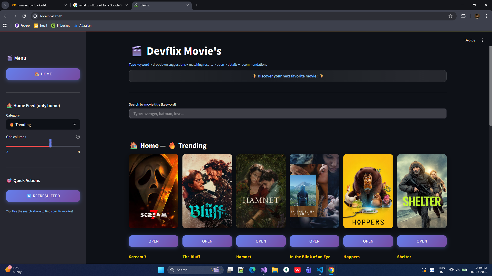

# 🎬 Devflix – Movie Recommendation Web App


> A Netflix-style Movie Recommendation Web Application powered by Machine Learning.

Devflix is a content-based movie recommendation system that allows users to search for movies, explore trending titles, and receive intelligent recommendations based on similarity algorithms.

# 🎬 Movies Recommendation System

>A simple and intuitive **movie recommendation system** built using Python.  
This project allows users to input a movie name and get a list of similar movies based on data and similarity metrics.

---

## 🧠 About The Project

>This repository contains a movie recommendation engine that uses natural language processing (NLP) and vector similarity to suggest similar films.  
It’s ideal for learning recommendation systems, Python data manipulation, and basic machine learning techniques.

### Features

>✔ Accepts a movie title as input  
✔ Provides a list of movies most similar to the input  
✔ Uses pickle serialized models for fast recommendations  
✔ Easy to run locally with minimal setup  

---

## 🚀 Getting Started

### 📋 Prerequisites

>Make sure you have the following installed on your machine:

- Python 3.x  
- pip (Python package manager)

---

### 🔧 Installation

1. **Clone the repository**
   ```bash
   git clone https://github.com/DevHajariwala116/Movies.git

## 🖥️ Application Preview

